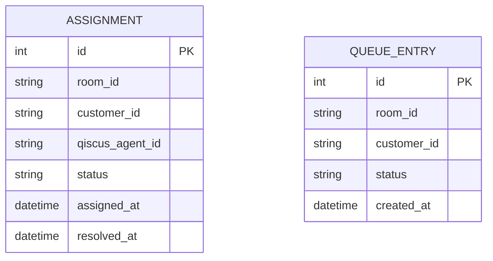

# Qiscus Custom Agent Allocation

Custom agent allocation service for Qiscus Omnichannel Chat: assigns incoming
chats to online agents up to a configurable max-capacity per agent, with a
FIFO queue when everyone is full.

## How it works

- `POST /webhook/allocation` — registered as the **Custom Agent Allocation**
  webhook in the Qiscus dashboard. Fires on a new/unassigned chat. Calls
  `Available Agents (v2)` live with the room's `room_id` to get eligible
  agents plus each one's real `current_customer_count`, picks the
  least-busy one under our configurable cap, and calls `Assign Agent` - or
  enqueues the customer if nobody has room.
- `POST /webhook/resolved` — registered as the **Mark As Resolved** webhook.
  Marks our local assignment record resolved, then drains the FIFO queue.
- A background job (APScheduler, every `POLL_INTERVAL_SECONDS`) retries
  draining the queue. This exists because Qiscus has no webhook for "agent
  came back online" — only `New Session`, `Mark As Resolved`, `Custom Agent
  Allocation`, `Custom Button`, and `User Logout` — so a customer queued
  while everyone was full/offline would otherwise stay stuck until some
  unrelated resolve happened to fire. The job checks the local queue table
  first and only spends an API call if someone's actually waiting, so it's
  a no-op on every tick where the queue is empty.

Online status and per-agent capacity are **not cached locally** - both are
read live from Qiscus (`Available Agents (v2)`) at the moment a decision is
needed, using whatever `room_id` triggered that decision (from the webhook
payload, or from the queued entry). This was a deliberate choice over
polling `Get All Agents` into a local cache: that endpoint doesn't expose a
customer-count field at all, so enforcing our configurable hard cap would
require tracking assignment counts ourselves - which can drift from
Qiscus's own state if anything changes agent load outside our webhook flow
(a manual dashboard assignment, a race condition, downtime). Reading live
avoids that whole class of bug at the cost of a bit more API traffic.

## ERD



No `AGENT` table - agent identity, online status, and current load are
never stored locally, only read live from Qiscus per-decision (see "How it
works" above). `ASSIGNMENT` is an audit/history record (not used for
capacity math). `QUEUE_ENTRY` has no FK to any agent - entries are matched
to whichever agent frees up first, in FIFO (`created_at`) order.

## Setup

```bash
python -m venv .venv
.venv\Scripts\activate      # Windows
pip install -r requirements.txt
copy .env.example .env      # then fill in QISCUS_APP_ID / QISCUS_SECRET_KEY
uvicorn app.main:app --reload
```

Docs at `http://localhost:8000/docs`.

## Configuration

All in `.env` (see `.env.example`):

- `QISCUS_APP_ID`, `QISCUS_SECRET_KEY` — from dashboard Settings. Used for
  every API call this service makes.
- `QISCUS_BASE_URL` — Multichannel API host (bare host, no `/api/vN` suffix
  - each endpoint's own version is baked into its path in `qiscus_client.py`).
- `DEFAULT_MAX_CAPACITY` — max concurrent customers per agent (per the spec:
  default 2, configurable). Compared against Qiscus's own
  `current_customer_count` per agent - see "How it works".
- `POLL_INTERVAL_SECONDS` — safety-net poll frequency.

## API notes (see `.claude/PLAN.md` for the full verification trail)

- `Available Agents (v2)` (`GET /admin/service/available_agents?room_id=`)
  is the only read API in the allocation flow - called live with a real
  `room_id` every time (from a webhook payload or a queued entry), so its
  required/optional status for that param doesn't matter for how we use it.
  Chosen over `Get All Agents` specifically because it's the only endpoint
  that exposes `current_customer_count` - required to enforce the
  configurable hard cap the spec asks for.
- `Assign Agent` (`POST /admin/service/assign_agent`) is the only write API
  called once the allocation logic picks an agent.
- `Allocate Agent` and `Mark As Resolved` are implemented in
  `qiscus_client.py` but intentionally unused by `allocation.py` -
  `Allocate Agent` applies Qiscus's own busyness ranking with no
  count/threshold, so it can't enforce our configurable cap; `Mark As
  Resolved` is a manual testing helper (trigger the real "Mark As Resolved"
  webhook without clicking resolve in the dashboard).

## Deploy

Any host that runs a long-lived Python process works (Railway, Render,
Fly.io, a plain VPS). A `Dockerfile` and `Procfile` are included.

1. **Persistent storage matters**: the SQLite DB holds the FIFO queue and
   assignment history - if the host's filesystem resets on redeploy (most
   serverless/ephemeral containers), that state is lost. Use a host with a
   persistent volume/disk, or swap `DATABASE_URL` for a managed Postgres.
   The `Dockerfile` defaults `DATABASE_URL` to `/app/data/allocation.db` -
   mount a volume at `/app/data`.
2. Set all of `.env`'s variables as environment variables on the host
   (`QISCUS_APP_ID`, `QISCUS_SECRET_KEY`, `QISCUS_BASE_URL`,
   `DEFAULT_MAX_CAPACITY`, `POLL_INTERVAL_SECONDS`) - don't rely on `.env`
   itself, it's gitignored and won't be in the deployed image.
3. Deploy (Railway: "Deploy from GitHub repo", it auto-detects the
   `Dockerfile`; Render: "New Web Service" from the repo, same detection).
4. Confirm `GET https://<deployed-url>/health` returns `{"status":"ok"}`.
5. In the Qiscus dashboard (Settings), point both webhooks at the deployed
   URL: `https://<deployed-url>/webhook/allocation` (Custom Agent
   Allocation toggle) and `https://<deployed-url>/webhook/resolved` (Mark
   As Resolved toggle).
